                      PORTADA
                
                instituto tecnologico de oaxaca
                Ing. en sistemas computacionales
                
                equipo:
                Badiola Barrita Jonathan
                Flores Santiago Wilver Alfredo
                
                grupo: 7SB
                
                maestra: Martinez Nieto Adelina

## Descripción del proyecto

Este proyecto consiste en el desarrollo de un sistema web de inicio de sesión que permite validar los datos ingresados por el usuario y posteriormente mostrar una interfaz principal del sistema.

El sistema cuenta con:

                -Validación de nombre de usuario.
                - Validación de correo electrónico.
                - Validación de contraseña.
                - Mensajes de error mediante alertas.
                - Pantalla principal después del inicio de sesión.
                - Navbar con información del usuario.
                - Sidebar de navegación.
                - Modal con información del perfil.
                - Botón de salida del sistema que redirige nuevamente al login.

El objetivo principal del proyecto due aprender a trabajar en equipo y conocer como funciona.

# Tecnologías utilizadas

## HTML5

## CSS3

## Bootstrap

## JavaScript

Este facilito la creación de interfaces modernas mediante componentes prediseñados.

Se utilizaron elementos como:

                  * Navbar.
                  * Botones.
                  * Grid del sistema.
                  * Contenedores.
                  * Clases de alineación y estilos.

## SweetAlert2

Se utilizó SweetAlert2 para mostrar mensaje de inicio de sesión exitoso.

---

# Funcionamiento del sistema

## Flujo del Login

El funcionamiento general del sistema es el siguiente:

1. El usuario ingresa sus datos en el formulario de login.

2. JavaScript obtiene los valores introducidos:

   * Nombre.
   * Correo.
   * Contraseña.

3. Se realizan validaciones para comprobar que la información sea correcta.

4. Si existe algún error, el sistema muestra un texto en color rojo indicando el problema.

5. Si los datos son correctos,se muestra un mensaje de login exitoso y el usuario es enviado al sistema principal.

6. En la página principal se muestra la información del usuario autenticado (no son los introducidos, unicamnete es una simulaciòn).

---

# Métodos principales utilizados

## Validación del formulario

Se realizaron funciones encargadas de validar los campos:

                  * Validación de nombre.
                  * Validación de correo.
                  * Validación de contraseña.


La majoria de funciones funcionan practicamente de la misma forma, pero solo explicare uno para que se entienda como funcionan.
Ejemplo:

```javascript
function validarCorreo(){
  // Verrifica que el correo no este vacio
  // Verifica que el correo cumple con el formato establecido
  // En caso de que no cumpla algun campo manda un mensaje segun el fallo
  // Si todo esta bien retornara true
}
```

---

## Inicio de sesión

El inicio de sesion unicamente valida los datos ingresados, es decir que no los campos no esten vacios y que tengan el formato establecido.
En caso de que todo este correcto redirecciona al inicio.html.

---

## Cierre de sesión

El botón de salir elimina la información guardada y regresa al usuario al login.

---

# Proceso de creación del sistema

## 1. Creación del formulario Login

Primero se creó la interfaz del inicio de sesión utilizando HTML y CSS.

Elementos creados:

* Campo nombre.
* Campo correo.
* Campo contraseña.
* Botón ingresar.

Captura:


---

## 2. Validaciones del formulario

Después se agregaron validaciones mediante JavaScript.

Ejemplos:

### Correo vacío

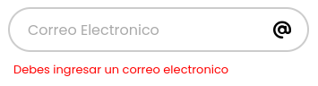

### Correo inválido

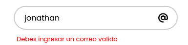

### Contraseña vacía

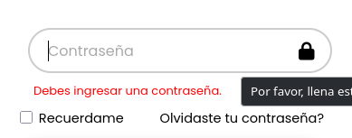

### Contraseña incorrecta

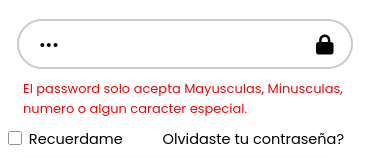

---

# 3. Creación del SlideBar

Después del inicio de sesión se creó un slidebar donde aparece opciones del sistema.

Captura:

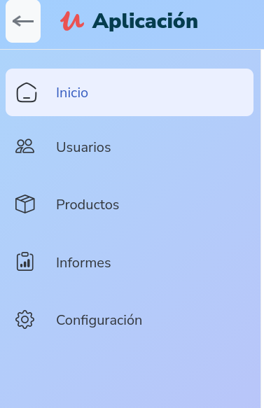

---

# 4. Creación del Desplegable

Se agregó un desplegable del usuario, se mostraran capturas e informes.


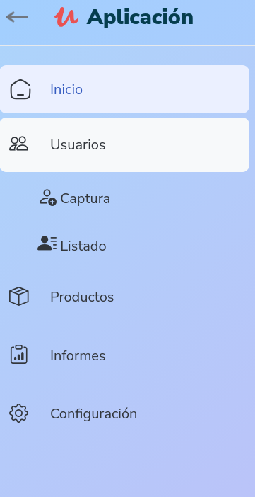

---

# 5. Modal de información del perfil

Se implementó un modal para mostrar información adicional del usuario.

Información mostrada:

* Fotografía.
* Nombre.
* Correo.

Captura:

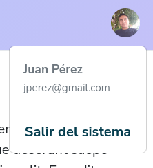

---

# Flujo completo funcionando

## Inicio de sesión

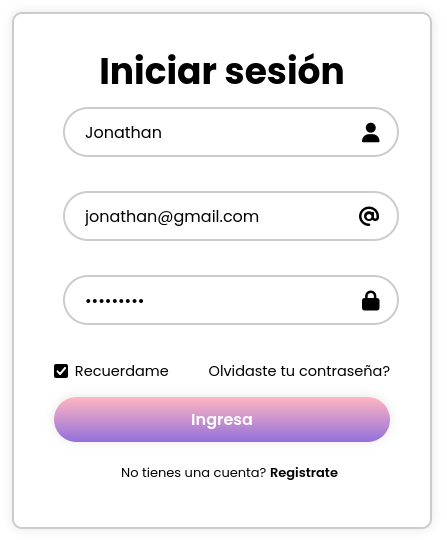

## Acceso exitoso al sistema

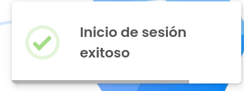

## Página principal

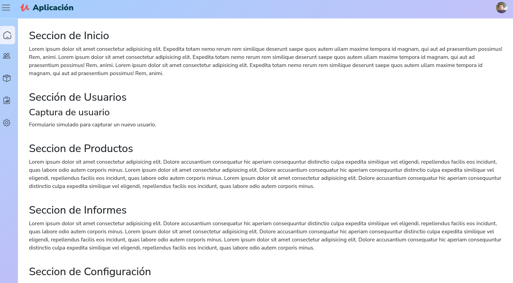

## Salida del sistema

Al presionar el botón de cerrar sesión, el usuario es redirigido nuevamente al formulario de login.

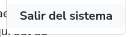

---

# Conclusión

La creación de este proyecto permitió aplicar conceptos fundamentales del desarrollo web frontend, como manejo de formularios, validaciones con JavaScript, diseño con Bootstrap y manipulación del almacenamiento local del navegador.

Tambien reforzo el uso de github junto a un compañero, esto nos permitio conocer como funciona un flujo de trabajo.

El sistema desarrollado cumple con el objetivo de proporcionar un flujo completo de autenticación visual, desde el ingreso del usuario hasta la navegación dentro del sistema.
